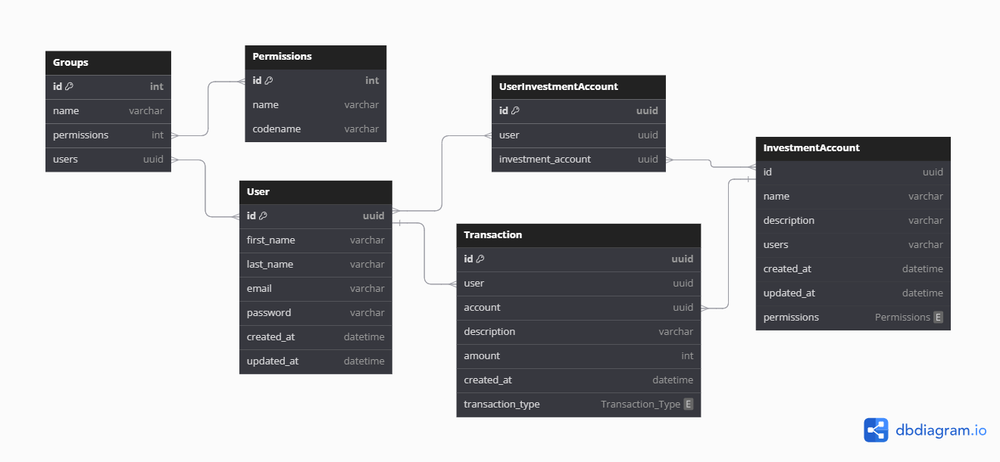

# Investment Accounts Management System
A Django Rest Framework (DRF) API for managing investment accounts. Allows users to belong to multiple accounts with different permission levels, including view-only, CRUD, and post-only access. The API also features an admin endpoint for viewing user transactions with a date range filter, nesting their total balance.


## Features

- **User Permissions**: Defines permissions for users on investment accounts, including view-only, full CRUD, and transaction posting.
- **Admin Endpoint**: Provides detailed transaction information with a nested sum of the user's total balance and a date range filter.
- **Unit Tests**: Comprehensive unit tests to ensure API functionality.
- **GitHub Actions**: Automatic execution of unit tests using GitHub Actions.

## Entity Relation Diagram
https://dbdiagram.io/d/GOInvest-66dd50e4eef7e08f0e06a8c7


## Setup and Installation

### Prerequisites

- Python 3.8+
- Django 4.0+
- Django Rest Framework 3.12+

### Installation

1. **Clone the Repository**

   ```bash
   git clone https://github.com/Gad-Ongoro/go_invest.git
   cd server
   ```

2. **Create and Activate a Virtual Environment**

   ```bash
   python -m venv venv
   source venv/bin/activate  # On Windows use `venv\Scripts\activate`
   ```

3. **Install Dependencies**

   ```bash
   pip install -r requirements.txt
   ```

4. **Apply Migrations**

   ```bash
   python manage.py migrate
   ```

5. **Create a Superuser**

   ```bash
   python manage.py createsuperuser
   ```

6. **Run the Development Server**

   ```bash
   python manage.py runserver
   ```

## API Endpoints

### Investment Accounts

- **List Investment Accounts**

  ```
  /api/investment-accounts/
  ```

- **Retrieve Investment Account**

  ```
  /api/investment-accounts/{id}/
  ```

### Transactions

- **List Create Transactions**

  ```
  /api/investment-accounts/<uuid:account_id>/transactions/
  ```

- **Retrieve, Update, Delete Transaction**

  ```
  /api/investment-accounts/<uuid:account_id>/transactions/{id}/
  ```

### Admin Endpoints

- **User Transactions with Balance**

  ```
  GET /api/admin/users/<uuid:user_id>/transactions/
  ```

  - **Query Parameters:**
    - `user_id`: ID of the user
    - `start_date`: Start date of the range (YYYY-MM-DD)
    - `end_date`: End date of the range (YYYY-MM-DD)

## User Permissions

- **Investment Account 1**: View-only rights; users cannot make transactions.
- **Investment Account 2**: Full CRUD permissions.
- **Investment Account 3**: Can post transactions but cannot view them.

## Unit Tests

Tests are located in the `investment_accounts/tests` directory. To run the tests:

```bash
python manage.py test
```

## GitHub Actions

A GitHub Action is set up to automatically run unit tests on every push and pull request. You can find the configuration in `.github/workflows/run-tests.yml`.

## Contributing

1. **Fork the Repository**
2. **Create a Feature Branch**

   ```bash
   git checkout -b feature/your-feature
   ```

3. **Commit Your Changes**

   ```bash
   git commit -m "Add new feature"
   ```

4. **Push to the Branch**

   ```bash
   git push origin feature/your-feature
   ```

5. **Create a Pull Request**

   Go to the repository on GitHub and create a pull request.

---